# PPServerSeamless 仓库深度分析报告

> 仓库：`Bismarck777666/PPServerSeamless` · 最近提交 2025-09-01（"multi"）
> 规模：7.9 GB · 4,344 个 C# 源文件 · **675,748 行代码** · 10 个 Visual Studio 解决方案 · 72 个项目

---

## 一、这是什么

一套**私有 iGaming（线上老虎机）游戏服务端全家桶**，自述为 "All server side codes"。核心能力有两层：

1. **自建游戏服务端**：用 C# 重新实现了 400+ 款 Pragmatic Play（PP）等供应商老虎机的完整服务端逻辑（转轮、赔付、免费旋转、Bonus），直接对玩家客户端讲 PP 官方客户端协议（`gameService` 的 `doInit / doSpin / doCollect / doBonus / doGamble…`），不依赖官方游戏服务器。
2. **Seamless Wallet 运营商侧**：对外暴露标准 Seamless 钱包回调接口（`GetBalance / Withdraw / Deposit / RollbackTransaction / BetWin`），供聚合平台/代理系统对接；另有 `Transfer`（转账钱包）变体。

代码注释含韩语（如 `유저의 불법액션이므로 세션을 종료한다`），作者为韩国开发团队；项目代号 "GIT IGaming Solution"（gitslotpark 系列库名）。

---

## 二、全局架构：一套模板，十次复制

10 个解决方案中 8 个共享**完全相同的 7 项目 Akka.NET 集群骨架**：

```
Lighthouse(种子发现) + GITProtocol(协议库) + FrontNode + ApiNode
+ UserNode + SlotNode + ApiIntegration
```

所有节点均以 `ProjectReference` 引用 `GITProtocol` —— 全仓库唯一的共享代码枢纽（星型依赖，无环）。

| 解决方案 | 项目数 | LOC | 游戏逻辑 | 定位 |
|---|---|---|---|---|
| **Backend(GitSlotPark Seamless2)** | 7 | 94.5K | 411 | ★ 主力 PP Seamless 版 |
| Backend(GitSlotPark Seamless2 Free) | 8 | 138.5K | 582 | 免费游戏版 + `PPPromoBot`（锦标赛/Race 促销机器人） |
| Backend(GitSlotPark Transfer) | 6 | 124.4K | 574 | 转账钱包模式（无 ApiIntegration） |
| GITGameServerSolution2024(ItalyApi) | 6 | 103.6K | 482 | 意大利合规版（CommunicationNode 架构） |
| Backend(PGSoft) | 10 | 55.6K | 249 | PGSoft + BackendServer + 2 个数据抓取器 |
| Backend(GitSlotPark AmaticSeamless) | 7 | 42.1K | 206 | Amatic Seamless |
| GreentubeSlotBackend | 7 | 31.1K | 129 | Greentube |
| Backend(Amatic Json) | 4 | 31.8K | 167 | 6 供应商枚举：PP/BNG/CQ9/HABANERO/PLAYSON/AMATIC |
| AristocratServer | 10 | 30.4K | 31 | SlotCityCasino（CommNode/PromoNode/QueenApi/SeamlessApi 四 API 节点） |
| EGTSlotBackend | 7 | 23.7K | 100 | 9 供应商枚举（+GREENTUBE/EGT） |

**演进脉络**：供应商枚举从 `COUNT=1`（纯 PP）→ `COUNT=6` → `COUNT=9`，游戏 ID 从 2001 起连续编号到 464 个，可见是从单一 PP 私服逐步扩成多供应商平台的。



---

## 三、单方案解剖：Seamless2 集群内部

每个节点都是 **Topshelf 托管的 Windows 服务**，加入名为 `godgaming` 的 Akka.Cluster：

- **Lighthouse** — Petabridge 开源种子节点，仅做集群成员发现（`akka.tcp://godgaming@:4055`）。
- **GITProtocol** — 共享类库：`GITMessage` 消息基类、`GAMEID` 枚举（464 个游戏）、`BetweenServersMessage` 节点间消息、内置 **PcgRandom** 随机数实现（自研 RNG，未见第三方认证）。
- **FrontNode** — OWIN 自托管 WebAPI，4 个控制器：`PPServiceController`（`auth.do / gameService / stats.do / logout.do / reloadBalance.do / minilobbyGames / saveSettings.do`）、`PPHistoryController`、`PPReplayController`、`PPPromoController`。
- **UserNode** — 每在线用户一个 `UserActor`（会话状态机 + 钱包），`UserManager` 管理生命周期；承担余额校验与防重放（`index/counter` 计数器）。
- **SlotNode** — 计算核心。`GameCollectionActor` 按 GAMEID 路由到具体 `xxxGameLogic` Actor（PPGames~PPGames18 共 18 个分组、411 个游戏类，继承自 `BasePPSlotGame / BasePPClassicGame / BaseSelFreePPSlotGame` 等 5 个基类）；`PayoutPoolActor` 做奖池调节；`Chipset/*.info` 提供 10+ 币种（AUD/BRL/EUR/IDR/INR/NGN…）的筹码配置。
- **ApiNode** — 对运营商的 GIT API：`AgentActor/AgentManager` 代理体系、`ChipsetManager`。
- **ApiIntegration** — Seamless 钱包回调（`CallbackApiController`）+ 上游官方 API 对接。

**数据库代理层**（每节点内置同一套）：`DBProxyWriter`（DBWriteWorker 写池）+ `DBProxyReader`（consistent-hashing 读池）+ `DBProxyMonitor`（MonitorSnapshot 指标）+ `RedisDatabase/RedisWriter`。

**数据层三件套**：MS SQL Server（主库，EF6）+ Redis（会话/余额缓存，46 处引用）+ MongoDB（带 `mongocrypt` 字段级加密的动态库，存游戏记录）。



---

## 四、核心链路：一次 Spin 的完整旅程



要点：
1. FrontNode 只做协议解析与鉴权，业务走 Akka `Ask`（10s 超时）进集群；
2. `doInit` 特殊处理——先走 `procEnterGame` 进场流程再处理消息；
3. 游戏结果由 SlotNode 的 GameLogic Actor 现算（自研 PCG 随机数 + PayoutPool 奖池调节），**输赢在服务端完全可控**；
4. 写库异步化（DBWriteWorker 池），读库走 consistent-hashing 池分压；
5. 异常被静默吞掉（`catch (Exception) {}`），统一返回 `"unlogged"`。

---

## 五、仓库组织



---

## 六、关键发现与风险

### 严重：凭证明文入库
- **44 个 `.hocon` 配置文件**含硬编码生产凭据，且已随 Git 历史公开：
  - MSSQL `sa` 密码：`akduifwkro1988`、`kir_star1996`、`tmdflwk123$%^`、`123123` 等
  - Redis 密码：`akduifwkro`
  - 公网 IP 直接写死（如 `18.134.13.108:1433`，AWS 伦敦区）
- **处置建议**：立即轮换全部凭据 → 用 `git filter-repo` 清洗历史 → 配置改为环境变量/密钥管理。

### 架构层面
- **复制粘贴式多方案**：8 套方案共享骨架却各自拷贝维护（GITProtocol 有 10 份拷贝，游戏逻辑跨方案重复数千个文件），改 bug 要改 N 处。建议抽成共享 NuGet/git submodule。
- **无测试**：全仓库仅 ItalyApi 下有一个 `AkkaTest` 试验项目，675K 行代码零单元测试覆盖。
- **异常静默**：`catch (Exception) {}` 模式普遍，生产故障难排查。
- **自研 RNG 无认证**：PcgRandom 自实现 + `PayoutPoolActor` 奖池调节，无任何第三方 RNG 认证（GLI-19 等），合规市场（如意大利版）会是硬伤。

### 做得好的
- Akka.Cluster 选型匹配业务：每用户 Actor、一致性哈希读池、路由分组都是教科书用法；
- 读写分离 + 异步写池 + Redis 缓存，数据层设计完整；
- 基类体系（5 个 Base 类承载 411 个游戏）复用度高。

---

## 七、技术栈总览

| 层 | 技术 |
|---|---|
| 语言/框架 | C# · .NET Framework（Topshelf Windows 服务） |
| 分布式 | Akka.NET（Cluster/Remote/Coordination）· Petabridge.Cmd · Lighthouse |
| Web | OWIN 自托管 ASP.NET WebAPI |
| 数据 | MS SQL Server + EF6 · StackExchange.Redis · MongoDB(+mongocrypt) |
| 序列化 | Newtonsoft.Json · Google.Protobuf |
| 日志 | NLog（Akka.Logger.NLog） |
| 网络 | DotNetty |

---

*分析基于 commit `7a1d6a7`（2025-09-01）。图表源文件（.mmd）与渲染图（.svg）均在 `diagrams/` 目录，可直接编辑复用。*